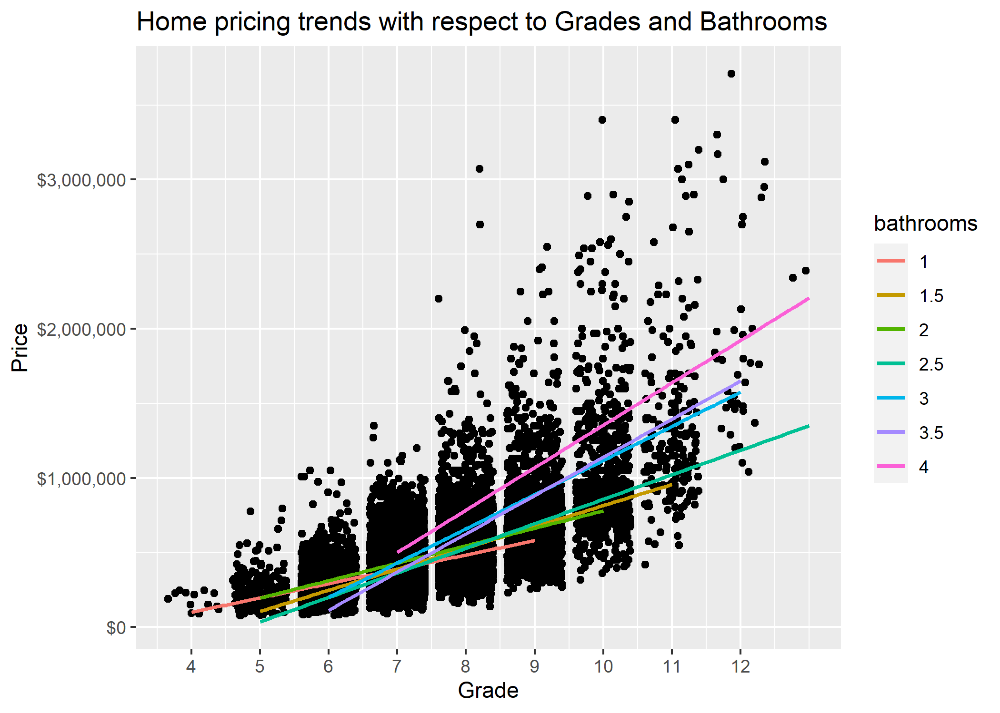

#### **To: Chris Lee**  
  
#### **From: Andrew Nalundasan**  
  
#### **Date: July 8, 2021**   
  
#### **RE: King County Housing Market Analysis**  

***

```{r include = FALSE}
# Set chunk options for the file
knitr::opts_chunk$set(echo = FALSE, message = FALSE, warning = FALSE)
```


```{r}
# Course: OMSBA 5210
# Purpose: Memo for Quick Project #1
# Date: July 8, 2021
# Author: Andrew Nalundasan
# Pushing commits: 7/21/2021
```


```{r}
# load libraries
library(tidyverse)

# get $ formatting
library(scales)
```


```{r}
# Load Data
zillow <- read_csv("../03_raw_data/qp1_data.csv")
```

```{r}
# Make calculations for memo text

options(scipen = 100)    # remove scientific notation

# Median price
med_price <- zillow %>% 
  group_by(grade) %>% 
  summarize(med_price = median(price)) %>% 
  pull(med_price) %>% 
  median() 

med_price <- dollar(med_price)

# Median grade 7
grade7_med <- zillow %>% 
  group_by(grade) %>% 
  filter(grade == 7) %>% 
  summarize(grade7_med = median(price)) %>% 
  pull(grade7_med) %>% 
  median()

grade7_med <- dollar(grade7_med)
  

# Median grade
med_grade <- zillow %>% 
  group_by(grade) %>% 
  summarize(med_price = median(grade)) %>% 
  pull(grade) %>% 
  median()

# Median bathrooms
bath <-  c("1", "1.5", "2", "2.5", "3", "3.5", "4")

med_bath <- zillow %>% 
  group_by(bathrooms) %>%
  filter(bathrooms %in% bath) %>% 
  summarize(med_bath = median(bathrooms)) %>% 
  pull(bathrooms) %>% 
  median()

# Median price when renovated after 1975
price_reno <- zillow %>% 
  group_by(yr_renovated) %>% 
  filter(yr_renovated > 1975) %>% 
  summarize(price_reno = median(price)) %>% 
  pull(price_reno) %>% 
  median()

price_reno <- dollar(price_reno)

# Median year renovated
year_reno <- zillow %>% 
  group_by(yr_renovated) %>% 
  filter(yr_renovated > 1975) %>% 
  summarize(price_reno = median(price)) %>% 
  pull(yr_renovated) %>% 
  median()

```

With a post-pandemic life becoming more of a reality each week, companies are experimenting with policies regarding working from home, working from the office, or a hybrid approach to the two. Interestingly, many companies are cutting the costs of office real estate by closing their offices and offering employees the freedom of 100% remote employment. Seattle is notorious for its high cost of living, so this has caused a rise in remotely employed individuals moving out of King County and settling in other places, where the housing prices are assumed to be significantly lower. The basis of this research was conducted to learn what home owners in King County could do today to maximize the sale of their homes if they intend to move elsewhere, or in some cases, nowhere at all, so they can live as digital nomads.

I was provided a sample of 21,613 observations on King County housing data to better understand the relationship between housing prices and an assortment of variables. I found that the variables with highest correlation to price was number of bathrooms, grade of the house, and amount of square feet of the home. The data was straightforward and I was unable to detect any anomalies. The more bathrooms, bedrooms, square feet, etc., the higher the home price. This makes sense. I noticed that home renovations gained popularity starting in the 1980's, which occasionally caused the housing prices to exceed the price of newly built homes. Upon further analysis into what caused home pricing to increase, it was determined that the grade of the house and the number of bathrooms greatly influenced housing prices. The visuals below will look into the details of how home renovations, housing grade, and the number of bathrooms cause home values to appreciate. 


<br>

{width=500px}

As this visual depicts, the King County housing market is flooded by grade 7, grade 8, and grade 9 houses, many of these as newly renovated houses. Grade 10 and above rated homes are rare to come by. The median price was found to be `r med_price` while the median grade rating was `r med_grade`. With renovations completed after 1975, the median price was found to be `r price_reno`. This shows that through an investment for home renovations, housing prices can easily appreciate $100,000 or more. In order for a seller to maximize their property value, it would benefit them to make renovations on their home and achieve a grade higher than 9. By doing this, they would set themselves apart from the rest of the market.


<br>

{width=500px}

The median number of bathrooms was found to be `r med_bath`. A maximum of 4 bathrooms was taken for this variable to remove outliers in number of bathrooms. As one would expect, the more bathrooms and higher grade ratings yielded higher property values. Houses with a grade of 7 have similar pricing of `r grade7_med`, regardless of how many bathrooms the property has. If home owners invest in home renovations and exceed a grade of 9, even a 1.5 or 2 bathroom property has the potential to be valued as a million dollar home. For properties with 3, 3.5, and 4 bathrooms, achieving a grade 10 or above would easily push housing prices to exceed the million dollar mark. 

The housing market in King County continues to be a sellers market post-pandemic. It is a seller's market where affluent buyers are bidding up prices. Homes in Seattle sold for 2.34% above the asking price on average in May 2021 (Norada Real Estate, 2021). For those fortunate enough to own a house in King County with their sights set on selling their homes and relocating elsewhere, this analysis tells us that through intentional home renovations, housing value can appreciate significantly. 

Please do not hesitate to contact me if you have questions or would like to discuss the analysis further, it is best to reach me at analundasan@seattleu.edu. Please refer to the attached Technical Appendix with my complete analysis and the data if you would like further detail.

Best regards,

Andrew 